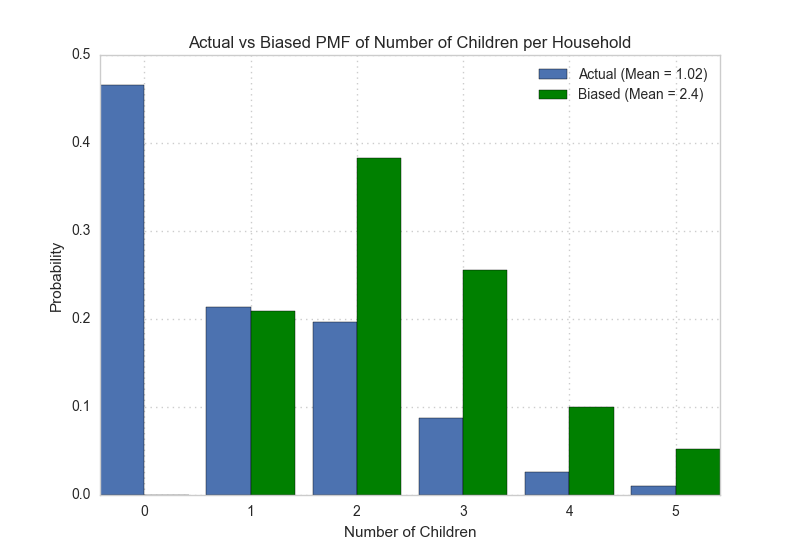

[Think Stats Chapter 3 Exercise 1](http://greenteapress.com/thinkstats2/html/thinkstats2004.html#toc31) (actual vs. biased)

This problem presents a robust example of actual vs biased data. As a data scientist, it will be important to examine not only the data that is available, but also the data that may be missing but highly relevant. You will see how the absence of this relevant data will bias a dataset, its distribution, and ultimately, its statistical interpretation.

#### Exercise 3.1

>Something like the class size paradox appears if you survey children and ask how many children are in their family. Families with many children are more likely to appear in your sample, and families with no chil- dren have no chance to be in the sample.  
>
>Use the NSFG respondent variable NUMKDHH to construct the actual distribu- tion for the number of children under 18 in the household.
>
>Now compute the biased distribution we would see if we surveyed the children and asked them how many children under 18 (including themselves) are in their household.  
>
>Plot the actual and biased distributions, and compute their means.

The bar chart below shows the difference in actual and biased distributions of the number of children per household. The biased distribution completely eliminates households with no children, and has much higher probabilities for 2-4 children per household than the actual distribution. As a consequence, the the biased distribution has a higher mean of 2.4 children, whereas the mean of the actual distribution is only 1.02.



#### Python Code

```python
import numpy as np
import pandas as pd
import matplotlib.pyplot as plt
import seaborn as sns

Think Stats module
import nsfg

sns.set_style('whitegrid', rc={'grid.linestyle': ':'})

# Uncomment for Jupyter Notebooks
# %matplotlib inline

def construct_pmf(data):
    '''
    INPUT: data, numpy 1D array/pandas Series

    OUTPUT: pmf, pandas Series of data-value row index mapped to its associated probability. 

    Returns a pandas Series of the PMF distribution of the data.
    '''
    n = data.size
    pmf = data.value_counts()/n

    return pmf


def construct_bias_pmf(pmf):
    '''
    INPUT: pmf, pandas Series of PMF distribution

    OUTPUT: bias_pmf, pandas Series of data-value row index mapped to its biased probability. 

    Returns a pandas Series of the PMF distribution of the data by the magnitude of the data value.
    '''
    bias_pmf = pmf * pmf.index

    n = bias_pmf.sum()
    bias_pmf /= n

    return bias_pmf

def expected_value(pmf):
    '''
    INPUT: pmf, pandas Series of PMF distribution

    OUTPUT: expected_value, float

    Returns the expected value of the PMF.
    '''
    values = pmf.index.values
    probs = pmf.values

    expected_value = values.dot(probs)

    return expected_value 


def plot_pmfs(actual, biased, title, xlabel):
    '''
    INPUT: pmf_data, pandas Series of PMF distribution

    OUTPUT: None

    Plots a bar chart of the given PMF data.
    '''
    actual_mean = expected_value(actual)
    bias_mean = expected_value(biased)

    fig, ax = plt.subplots()

    width = 0.5
    actual_bar_loc = np.arange(actual.size) * 1.2
    bias_bar_loc = actual_bar_loc + width
    actual_label = 'Actual (Mean = {:.3})'.format(actual_mean)
    bias_label = 'Biased (Mean = {:.3})'.format(bias_mean)
    

    ax.bar(actual_bar_loc, actual.values, width=width, label=actual_label)
    ax.bar(bias_bar_loc, biased.values, width=width, label=bias_label, color='green')
    ax.set_xticks(bias_bar_loc)
    ax.set_xticklabels(actual.index)
    ax.set_title(title)
    ax.set_xlabel(xlabel)
    ax.set_ylabel('Probability')
    ax.legend()

# Load NSFG data into dataframe
df = nsfg.ReadFemResp()

actual_pmf = construct_pmf(df.numkdhh)
bias_pmf = construct_bias_pmf(actual_pmf)

plot_pmfs(actual_pmf, 
      bias_pmf, 
      "Actual vs Biased PMF of Number of Children per Household", 
      "Number of Children")

plt.show()
```
