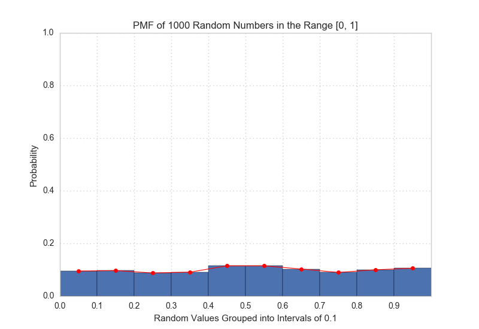
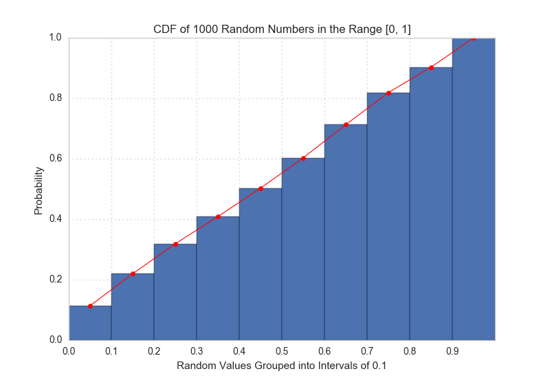

[Think Stats Chapter 4 Exercise 2](http://greenteapress.com/thinkstats2/html/thinkstats2005.html#toc41) (a random distribution)

This questions asks you to examine the function that produces random numbers. Is it really random? A good way to test that is to examine the pmf and cdf of the list of random numbers and visualize the distribution. If you're not sure what pmf is, read more about it in Chapter 3.

#### Exercise 4.2

>The numbers generated by random.random are supposed to be uniform between 0 and 1; that is, every value in the range should have the same probability.
>
>Generate 1000 numbers from random.random and plot their PMF and CDF. Is the distribution uniform?

The PMF and CDF graphs below suggest a uniform distribution for the 
`numpy.random.rand` function.  

The randomly-generated numbers from the half-open range, \[0, 1\] were grouped into intervals of tenths (0.1).  The PMF graph shows an approximately even probability of 0.1 across all ten groups. Similarly the CDF graph follows a straight-line progression.





#### Python Code

```python
import numpy as np
import pandas as pd
import matplotlib.pyplot as plt
import seaborn as sns


sns.set_style('whitegrid', rc={'grid.linestyle': ':'})

# Uncomment for Jupyter Notebook
# %matplotlib notebook


def rand_pmf_cdf(n):
    '''
    INPUT: n, integer

    OUTPUT: pmf, pandas Series of PMF of random samples
            cdf, pandas Series of CDF of random samples

    Returns the PMF and CDF of 'n' randomly-generated numbers from the half-open interval, [0, 1]
    '''    
    data = np.random.rand(n)
    df = pd.DataFrame({'raw_data': data})

    # Group [0, 1] into intervals of 0.1 
    df['grouped'] = df.raw_data.map(lambda n: float(str(n)[:3]))

    pmf = df.grouped.value_counts(normalize=True).sort_index()
    cdf = pmf.cumsum()

    return pmf, cdf


def plot_dist(data, title=None, xlabel=None):
    '''
    INPUT: data, pandas Series of PMF or CDF distribution

    OUTPUT: None

    Plots the bar chart of the PMF or CDF distribution of the given data.
    '''
    fig, ax = plt.subplots()

    bar_loc = np.arange(data.size)
    width = 1

    ax.bar(bar_loc, data.values, width=width)
    ax.set_xticks(bar_loc)
    ax.set_xticklabels(data.index)
    ax.set_xlabel(xlabel)
    ax.set_ylabel("Probability")
    ax.set_title(title)
    ax.set_ylim(0, 1)

    # Plot line graph of probabilities
    ax.plot(bar_loc + (width/2), data.values, 'ro-', 
            linewidth=0.8, markersize=5)

pmf, cdf = rand_pmf_cdf(1000)

plot_dist(pmf, 
          "PMF of 1000 Random Numbers in the Range [0, 1]",
          "Random Values Grouped into Intervals of 0.1")

plot_dist(cdf, 
          "CDF of 1000 Random Numbers in the Range [0, 1]",
          "Random Values Grouped into Intervals of 0.1")

plt.show()

```


