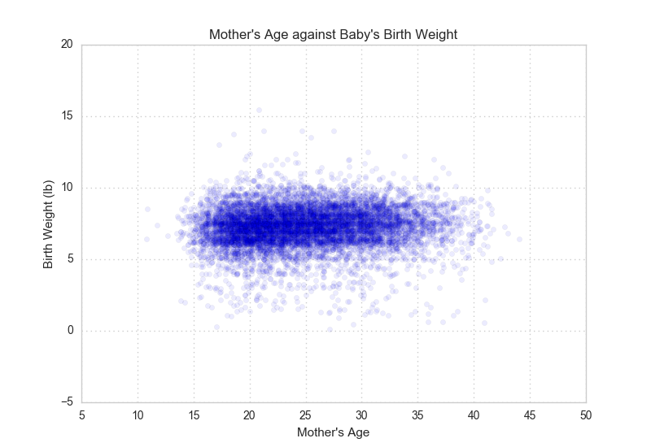
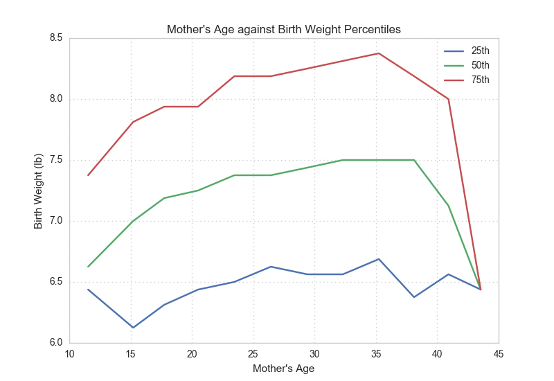

[Think Stats Chapter 7 Exercise 1](http://greenteapress.com/thinkstats2/html/thinkstats2008.html#toc70) (weight vs. age)

In this exercise, you will compute the effect size of correlation. Correlation measures the relationship of two variables, and data science is about exploring relationships in data.

#### Exercise 7.1

> Using data from the NSFG, make a scatter plot of birth weight versus mother’s age. Plot percentiles of birth weight versus mother’s age. Compute Pearson’s and Spearman’s correlations. How would you character- ize the relationship between these variables?

The scatter graph suggests independence between a mother's age and the birth weight of her baby. Irrespective of a mother's age, the majority of birth weights are concentrated across a range of approximately 6 to 9 lbs. 

The line graph shows a slight positive correlation between the percentiles of birth weights and a mother's age. With the exception of the two end points, the quartiles of birth weights appear evenly spaced. 

The end point anomalies can be explaiend by the markedly low birth weight samples at the two age extremes. The first age group of 10 years and below has 4 samples, and the last group of 43 years and above has 2 samples. This is contrasted by the minimum sample size amongst the other groups of 34.

The relationship between the two variables demonstrated in the graphs is corroborated by the Pearson's product-moment correlation and Spearman's rank correlation values. 

| Correlation | Value |
| --- | --- |
| Pearson | 0.068834 |
| Spearman | 0.094426 |

Both indicate a very marginal positive correlation, with the Pearson value approximately 30% lower than the Spearman value. However, given both their low absolute values of less than 0.1, this difference is not statistically significant.
